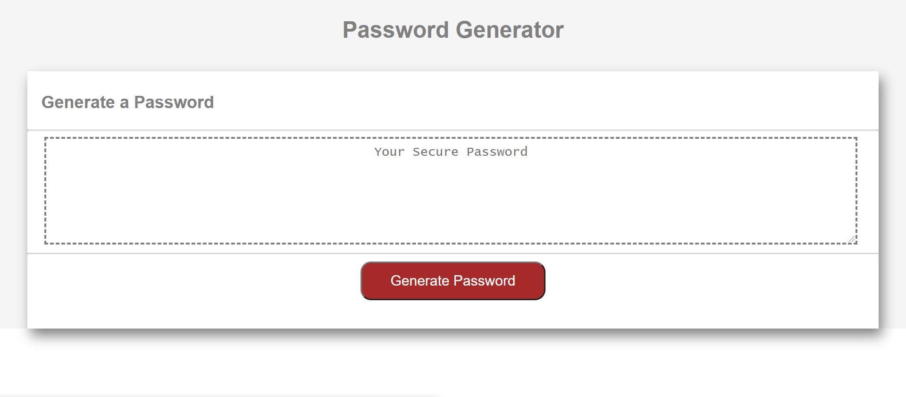

# pwdGenerator
## Table of Contents
* [Description](#description)
* [Installation](#installation)
* [Application](#application)
* [Credits](#credits)

## Description
The purpose of this website is to provide a way for a user to create a secure password between 8 to 128 characters that includes at least one of the following character types: 
 
 * Uppercase characters
 * Lowercase characters
 * Numbers
 * Special characters

The user will click the "Generate Password" Button and will be prompted to answer questions regaarding the character types to include in the password. Once this is selected, the password will be displated in the Your Secure Password textbox.

While working on this project, I learned about prompts, arrays, loops and if statements.
 
 
  
 
## Installation
1. Access my GitHub repository using the following link: https://github.com/denisequarles1/pwdGenerator

2. Clone the repo by copying the key.

3. Use GitBash to enter the following: git clone [key]

4. The repository will then be copied onto your computer and you can run the index file to see the Horiseon website.

 

## Application
The deployed application can be found here: https://denisequarles1.github.io/pwdGenerator/

 

## Credits
W3Schools: https://www.w3schools.com/

Markup Validation Service: https://validator.w3.org/

